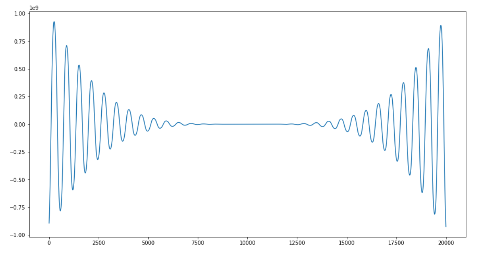

# f(x) = -12x^4*sin(cos(x)) - 18x^3+5x^2 + 10x - 30

**1. Определить корни**

Функция имеет бесконечное множество корней.

**2. Найти интервалы, на которых функция возрастает**

**3. Найти интервалы, на которых функция убывает**

Интервалов, на которых функция возрастает и убывает, бесконечное множество, что наглядно видно на графике.

**4. Построить график**

**5. Вычислить вершину**

Вершин бесконечное множество, что наглядно видно на графике.

**6. Определить промежутки, на котором f > 0**

**7. Определить промежутки, на котором f < 0**

Количество промежутков, на котрых f > 0 и f < 0, также бесконечное множество.
